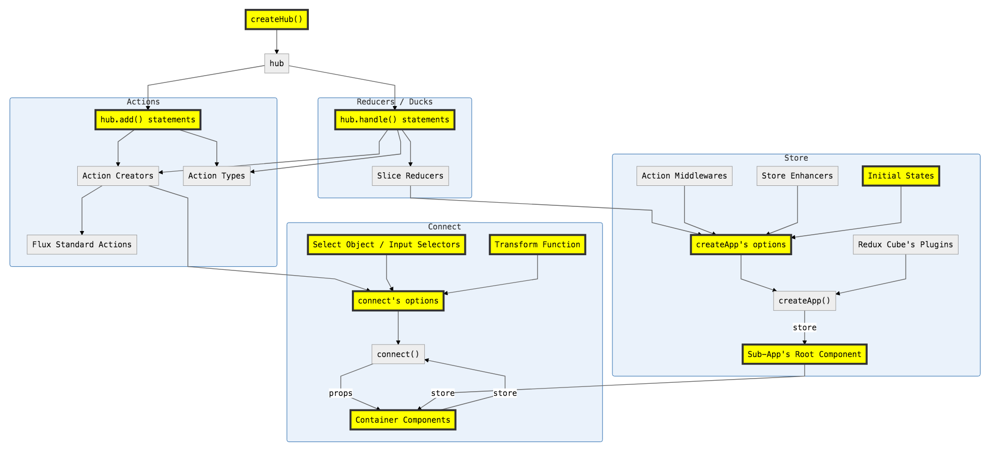

# Redux Cube

[< Back to Project WebCube](https://github.com/dexteryy/Project-WebCube/)

[![NPM Version][npm-image]][npm-url]
<!-- [![Build Status][travis-image]][travis-url]
[![Dependencies Status][dep-image]][dep-url] -->

[![Nodei][nodei-image]][npm-url]

[npm-image]: https://img.shields.io/npm/v/redux-cube.svg
[nodei-image]: https://nodei.co/npm/redux-cube.png?downloads=true
[npm-url]: https://npmjs.org/package/redux-cube
<!--
[travis-image]: https://img.shields.io/travis/dexteryy/redux-cube/master.svg
[travis-url]: https://travis-ci.org/dexteryy/redux-cube
[dep-image]: https://david-dm.org/dexteryy/redux-cube.svg
[dep-url]: https://david-dm.org/dexteryy/redux-cube
-->

 |  |  |
--- | --- | --- |
iOS 7+ ✔ | Android 4+ ✔ | 11+ ✔ |

Redux Cube is an app state manager. It is part of my effort to simplify the usage of all 'mainstream' tools and best practices mentioned in the [Spellbook of Modern Web Dev](https://github.com/dexteryy/spellbook-of-modern-webdev/). It can reduce boilerplate and support many patterns (like Sub App, Reducer Bundle, ...)


<!-- Slides: [Introduction to Redux Cube](https://app.cubemage.cn/slides/intro-to-redux-cube/index.html) -->

```
npm install --save-dev redux-cube
```


<!-- @import "[TOC]" {cmd="toc" depthFrom=2 depthTo=6 orderedList=false} -->
<!-- code_chunk_output -->

* [Examples](#examples)
* [Overview](#overview)
	* [Action Type](#action-type)
	* [Action Creators](#action-creators)
	* [Reducers](#reducers)
	* [Async Action Creators / Side Effects](#async-action-creators-side-effects)
	* [Ducks Modular / Reducer Bundle](#ducks-modular-reducer-bundle)
	* [Connect to React Components](#connect-to-react-components)
	* [Sub-Apps](#sub-apps)
	* [Immutable](#immutable)
* [API](#api)
	* [redux-cube](#redux-cube-1)
		* [`createApp`](#createapp)
		* [`createHub`](#createhub)
		* [`connect`](#connect)
	* [Plugins](#plugins)
		* [withPersist](#withpersist)
		* [withImmutable](#withimmutable)
		* [withRouter](#withrouter)
		* [withRouter3](#withrouter3)

<!-- /code_chunk_output -->


## Examples

* "react-redux-app" and "react-redux-router-app" in [Initial Webcube Examples](https://github.com/dexteryy/Project-WebCube/tree/master/examples/webcube-initial-structure)
* [Webcube's TodoMVC Example](https://github.com/dexteryy/Project-WebCube/tree/master/examples/webcube-todo-app/)

## Overview

<!--  -->

### Action Type

```js
// sampleApp/hub.js
import { createHub } from 'redux-cube';

export default createHub();
```

`createHub` returns a `Hub` instance which is an namespace manager of action types and a set of helper functions used to generate standard action object (follow [Flux Standard Action](https://www.npmjs.com/package/flux-standard-action) and other best practices) and action creators.

```js
// sampleApp/actions/sample.js
import hub from '../hub';

export const { actions, types } = hub.add('NAMESPACE/MORE_NAMESPACE/MY_TYPE');
```

```js
export const { actions, types } = hub.add('namespace.moreNamespace.myType');
```

```js
export const { actions, types } = hub.add({
  NAMESPACE: {
    MORE_NAMESPACE: {
      MY_TYPE: true
    },
  },
});
```

```js
export const { actions, types } = hub.add({
  namespace: {
    moreNamespace: {
      myType: true
    },
  },
});
```

The above codes are equivalent.

```js
console.log(types)
// {
//   'NAMESPACE/MORE_NAMESPACE/MY_TYPE': defaultActionCreator,
// }

console.log(actions)
// {
//   namespace: {
//     moreNamespace: {
//       myType: defaultActionCreator,
//     },
//   },
// }
```

The `defaultActionCreator` is equivalent to:

```js
() => ({
  type: 'NAMESPACE/MORE_NAMESPACE/MY_TYPE',
  payload: defaultPayloadCreator,
  meta: undefined,
})
```

The `defaultPayloadCreator` is equivalent to:

```js
a => a
```

### Action Creators

```js
export const { actions, types } = hub.add('NAMESPACE/MORE_NAMESPACE/MY_TYPE', payloadCreator, metaCreator);
```

```js
export const { actions, types } = hub.add({
  namespace: {
    moreNamespace: {
      myType: true,
      myType2: payloadCreator,
      myType3: [payloadCreator, metaCreator],
      myType4: [
        (a, b) => ({ data: a + b }),
        (a, b) => ({ a, b }),
      ],
      myType5: {
        [hub.ACTION_CREATOR]: actionCreator,
      },
    },
  },
});
```

```js
actions.namespace.moreNamespace.myType(10);
// or
types['NAMESPACE/MORE_NAMESPACE/MY_TYPE'](10);
// results:
// {
//   "type": "NAMESPACE/MORE_NAMESPACE/MY_TYPE",
//   "payload": 10
// }
```

```js
actions.namespace.moreNamespace.myType4(1, 10);
// or
types['NAMESPACE/MORE_NAMESPACE/MY_TYPE_4'](1, 10);
// result:
// {
//   "type": "NAMESPACE/MORE_NAMESPACE/MY_TYPE_4",
//   "payload": { data: 11 },
//   "meta": { "a": 1, "b": 10 }
// }
```

### Reducers

```js
// sampleApp/reducers/sample.js
import hub from '../hub';

export const { reducer } = hub.handle({
  namespace: {
    moreNamespace: {
      myType: (state, { payload, meta }) => newState,
    },
  },
  anotherType: (state, { payload, meta }) => newState,
}, initialStateForASliceOfStore);
```

### Async Action Creators / Side Effects

* [redux-thunk](https://www.npmjs.com/package/redux-thunk)
* [redux-promise-middleware](https://www.npmjs.com/package/redux-promise-middleware)
* [redux-cube's Thunk Payload Middleware](https://github.com/dexteryy/Project-WebCube/blob/master/packages/redux-cube/lib/middlewares/thunkPayload.js)
* [redux-debounced](https://www.npmjs.com/package/redux-debounced)
* [redux-observable](https://www.npmjs.com/package/redux-observable)

```js
// sampleApp/actions/users.js
import hub from '../hub';
// https://www.npmjs.com/package/hifetch
import hifetch from 'hifetch';
import { reset } from 'redux-form';

export const { actions, types } = hub.add({
  users: {
    fetchAll: () =>
      // handle by redux-promise-middleware
      hifetch({
        url: '/v1/users/',
      }).send(),

    add: [
      (userId, userData, opt) =>
        // handled by Thunk Payload Middleware
        dispatch =>
          // handle by redux-promise-middleware
          hifetch({
            url: `/v1/users/${userId}`,
            method: 'put',
            data: userData,
            ...opt,
          }).send().then(response => {
            dispatch(reset('userInfos'));
            return response;
          }),
      userId => ({
        userId,
      }),
    ],

    delete: [
      (userId, userData) =>
        // handle by redux-promise-middleware
        hifetch({
          url: `/v1/users/${userId}`,
          method: 'delete',
        }).send(),
      userId => ({
        userId,
      }),
    ],

  },
});

// handle by redux-observable
export const epics = [
  action$ =>
    action$.pipe(
      ofType('USERS/DELETE_FULFILLED'),
      map(action => ({
        type: 'NOTIFY',
        payload: { text: 'DELETED!' },
      }))
    ),
];
```

```js
// sampleApp/reducers/users.js
import hub from '../hub';
import Immutable from 'immutable';

export const { reducer, actions, types } = hub.handle(
  {
    users: {
      fetchAllPending: state => state.set('isLoading', true),
      fetchAllFulfilled: (state, { payload }) =>
        state.mergeDeep({
          users: Immutable.fromJS(payload.data),
          isLoading: false,
        }),
      fetchAllRejected: state => state.set('isLoading', false),
      addPending: state => state.set('isLoading', true),
      // ...
      deleteFulfilled: (state, { payload }) =>
        state.set(
          'users',
          state.get('users').filter(user => user.get('id') !== payload.userId),
        ),
    },
  },
  Immutable.fromJS({
    users: [],
    isLoading: false,
  }),
);
```

### Ducks Modular / Reducer Bundle

Original Ducks Modular:

```js
// widgets.js

// Action Types

// Action Creators

// Side Effects
// e.g. thunks, epics, etc

// Reducer
```

Redux Cube's Reducer Bundle:

```js
// sampleApp/ducks/actions/sample.js
import hub from '../../hub';

export const { actions, types } = hub.add({
  myType1: payloadCreator1,
  myType2: payloadCreator2,
});
```

```js
// sampleApp/ducks/sample.js
import hub from '../hub';
import { types as existTypes } from './actions/sample';

export const { reducer, types, actions } = hub.handle(
  // declared action type
  myType1: (state, { payload, meta }) => newState,
  // undeclared action type
  myType3: (state, { payload, meta }) => newState,
  // undeclared action type
  myType4: (state, { payload, meta }) => newState,
}, initialStateForASliceOfStore).with(existTypes);

export const epics = [
  action$ =>
    action$.pipe(/* ... */)
];
```

```js
import { actions, types } from '../reducers/sample';

console.log(actions);
// {
//   myType1: actionCreator1,
//   myType2: actionCreator2,
//   myType3: defaultActionCreator,
//   myType4: defaultActionCreator,
// }

console.log(types);
// {
//   MY_TYPE_1: actionCreator1,
//   MY_TYPE_2: actionCreator2,
//   MY_TYPE_3: defaultActionCreator,
//   MY_TYPE_4: defaultActionCreator,
// }
```

It is highly recommended to use "duck" files as the only authoritative sources of action types and action creators.

Action files should be only used by "duck" files. They should be totally transparent to all other code.

Because `hub.handle` can automatically add actions for undeclared action types, you only need to manually call `hub.add` (and maybe write them in a separate action file) when these actions have side effects

### Connect to React Components

```js
// sampleApp/containers/Sample.jsx
import { connect } from 'redux-cube';
import { autobind } from 'core-decorators';
import { actions as todoActions } from '../ducks/todo';

@connect({
  selectors: [
    state => state.todo.input,
    state => state.todo.items,
  ],
  transform: (input, items) => ({
    input,
    items,
    count: items.filter(item => !item.isCompleted).length,
  }),
 actions: todoActions,
})
export default class Main extends PureComponent {
  @autobind
  handleInputChange(content) {
   this.props.actions.todo.changeInput(content);
  }
  render() {
    const { input, items, count } = this.props;
```

Te above code is equal to

```js
// ...
import { createSelector } from 'reselect';

@connect({
  mapStateToProps: createSelector(
    [
      state => state.todo.input,
      state => state.todo.items,
    ],
    transform: (input, items) => ({
      input,
      items,
      count: items.filter(item => !item.isCompleted).length,
    }),
  ),
  mapDispatchToProps: dispatch => ({
    actions: {
      todo: {
        changeInput: (...args) => dispatch(
          todoActions.todo.changeInput(...args)
        ),
      },
    },
  }),
})
export default class Main extends PureComponent {
```

`mapDispatchToProps` option can be used together with `actions` option.

`mapStateToProps` option can be used together with `selectors` option.

### Sub-Apps

```js
// multipleTodoApp/todo/index.jsx
import React, { Component } from 'react';
import localforage from 'localforage';
import withPersist from 'redux-cube/lib/plugins/withPersist';
import { createApp } from 'redux-cube';

import { reducer as sampleReducer, epics } from './ducks/sample';
import { reducer as sample2Reducer, epics } from './ducks/sample2';
import Sample from './containers/Sample';

@createApp(withPersist({
  reducers: {
    items: sampleReducer,
    sample2: {
      data: sample2Reducer,
    },
  },
  epics,
  preloadedState: typeof window !== 'undefined' && window._preloadTodoData,
  devToolsOptions: { name: 'TodoApp' },
  persistStorage: localforage,
  persistKey: 'todoRoot',
}))
class TodoApp extends Component {
  render() {
    return <Sample />;
  }
}

export const App = TodoApp;
```

```js
// multipleTodoApp/index.jsx
import React, { Component } from 'react';
import { Route, Redirect, Switch } from 'react-router-dom';
import { createApp } from 'redux-cube';
import withRouter from 'redux-cube-withrouter';
import { App as TodoApp } from './todo';

const JediTodoApp = () => (
  <TodoApp
    title="Jedi Todo"
    routePath="/jedi-todo"
    appConfig={{
      persistKey: 'jediTodoRoot',
      devToolsOptions: { name: 'JediTodoApp' },
      preloadedState:
        typeof window !== 'undefined' && window._preloadJediTodoData,
    }}
  />
);
const SithTodoApp = () => (
  <TodoApp
    title="Sith Todo"
    routePath="/sith-todo"
    appConfig={{
      persistKey: 'sithTodoRoot',
      devToolsOptions: { name: 'SithTodoApp' },
      preloadedState:
        typeof window !== 'undefined' && window._preloadSithTodoData,
    }}
  />
);

@createApp(withRouter({
  supportHtml5History: isDynamicUrl(),
  devToolsOptions: { name: 'EntryApp' },
}))
class EntryApp extends Component {
  render() {
    const TodoApps = () => (
      <div>
       <JediTodoApp />
       <SithTodoApp />
      </div>
    );
    const JumpToDefault = () => <Redirect to="jedi-todo/" />;
    return (
      <Switch>
        <Route path="/" exact={true} render={JumpToDefault} />
        <Route path="/" render={TodoApps} />
      </Switch>
    );
  }
}

export const App = EntryApp;
```

### Immutable

[Frozen](https://www.npmjs.com/package/redux-immutable-state-invariant) plain object + [immutability-helper](https://www.npmjs.com/package/immutability-helper) / [icepick](https://www.npmjs.com/package/icepick) / [seamless-immutable](https://www.npmjs.com/package/seamless-immutable) / [dot-prop-immutable](https://www.npmjs.com/package/dot-prop-immutable) / [object-path-immutable](https://www.npmjs.com/package/object-path-immutable) / [timm](https://www.npmjs.com/package/timm) / [updeep](https://www.npmjs.com/package/updeep)

```js
@createApp(withPersist(withRouter({
  reducers,
  disableFreezeState: false, // default
  enableTopologic: true,
  // ...
})))
```

```js
import update from 'immutability-helper';
import hub from '../hub';

export const { reducer, types, actions } = hub.handle({
  changeInput: (state, { payload: content }) =>
    update(state, {
     input: { $set: content },
    }),
  todo: {
    clearCompleted: state =>
      update(state, {
        items: {
         $apply: items =>
            items.map(item =>
              update(item, {
               isCompleted: { $set: false },
              }),
            ),
        },
      }),
  },
}, {
  items: [],
  input: '',
});
```

ImmutableJS object + [redux-immutable](https://www.npmjs.com/package/redux-immutable)

```js
@createApp(withImmutable(withRouter({
  reducers, //
  // ...
})))
```


## API

### redux-cube

```js
import { createApp, createHub, connect } from 'redux-cube'
```

#### `createApp`

It's mainly a wrapper of [redux API](https://redux.js.org/docs/api/) and some must-have action middlewares, store enhancers, high-order reducers and high-order components.

It provides the support for [Sub-App pattern](https://gist.github.com/gaearon/eeee2f619620ab7b55673a4ee2bf8400) (React component with its own isolated Redux store)

Options

* `reducers`
* `reducer`
* `reducerDeps`
  * https://www.npmjs.com/package/topologically-combine-reducers
* `epics`
  * https://redux-observable.js.org/docs/basics/Epics.html
* `disableDevTools`
* `devToolsOptions`
  * https://github.com/zalmoxisus/redux-devtools-extension/blob/master/docs/API/Arguments.md
* `disableFreezeState`
* `enableTopologic`
  * https://www.npmjs.com/package/topologically-combine-reducers
* `loggerConfig`
  * https://www.npmjs.com/package/redux-logger#options
* promiseMiddlewareConfig`
  * https://github.com/pburtchaell/redux-promise-middleware/blob/4843291da348fc8ed633c41e6afbc796f7152cc6/src/index.js#L14
* `preloadedState`
  * https://redux.js.org/docs/recipes/reducers/InitializingState.html
* `middlewares`
  * https://redux.js.org/docs/advanced/Middleware.html
  * https://redux.js.org/docs/api/applyMiddleware.html
* `priorMiddlewares`
* `enhancers`
  * https://redux.js.org/docs/Glossary.html#store-enhancer
* `priorEnhancers`
* `storeListeners`

#### `createHub`

An superset and enhanced implement (almost a rewrite) of [redux-actions](https://www.npmjs.com/package/redux-actions).

It provides the support for namespace management and [Reducer-Bundle-or-Ducks-Modular-like pattern](https://medium.freecodecamp.org/scaling-your-redux-app-with-ducks-6115955638be)

Options:

* `delimiter`

#### `connect`

It's mainly a wrapper of [react-redux](https://www.npmjs.com/package/react-redux) and  [reselect](https://www.npmjs.com/package/reselect)

Options:

* `selectors`
* `transform`
* `mapStateToProps`
* `actions`
* `actionsProp`
* `mapDispatchToProps`

### Plugins

#### withPersist

```js
import withPersist from 'redux-cube/lib/plugins/withPersist'
```

Add support to `createApp` for [redux-persist](https://www.npmjs.com/package/redux-persist)

Options:

* `persistStorage`
* `persistKey`
* `persistConfig`

#### withImmutable

```js
import withImmutable from 'redux-cube/lib/plugins/withImmutable'
```

Add support to `createApp` for [redux-immutable](https://www.npmjs.com/package/redux-immutable)

#### withRouter

```js
import withRouter from 'redux-cube-withrouter'
```

Add support to `createApp` for [react-router v4+](https://reacttraining.com/react-router/) + [react-router-redux v5+](https://github.com/reacttraining/react-router/tree/master/packages/react-router-redux)

Options:

* `supportHtml5History`
* `routerConfig`

#### withRouter3

```js
import withRouter3 from 'redux-cube-withrouter3'
```

Add support to `createApp` for [react-router v3](https://github.com/ReactTraining/react-router/tree/v3/docs) + [react-router-redux v4](https://github.com/reactjs/react-router-redux)

Options:

* `disableHashRouter`
* `routerHistoryConfig`

<!-- ### redux-cube/lib/remote (TODO)

* `import { middleware, reducers } from 'redux-cube/lib/remote/fetch'`
    * Use fetch API, based on [hifetch](https://www.npmjs.com/package/hifetch)
* `import { middleware } from 'redux-cube/lib/remote/axios'`
    * Use XHR API, a wrapper of [redux-axios-middleware](https://www.npmjs.com/package/redux-axios-middleware)

### redux-cube/lib/notify (TODO)

* `import { reducers, Notify } from 'redux-cube/lib/notify'`
* Alternative or wrapper of [react-notification-system-redux](https://www.npmjs.com/package/react-notification-system-redux) / [react-redux-toastr](https://www.npmjs.com/package/react-redux-toastr)

### redux-cube/lib/loading (TODO)

* `import { middleware, Loading } from 'redux-cube/lib/loading'`
* Wrapper of [react-block-ui](https://www.npmjs.com/package/react-block-ui)

### redux-cube/lib/track (TODO)

* `import { middleware } from 'redux-cube/lib/track'`
* `import bugSnag from 'redux-cube/lib/track/bugSnag'`
* `import googleAnalytics from 'redux-cube/lib/track/googleAnalytics'`
* Alternative or complement to [redux-beacon](https://www.npmjs.com/package/redux-beacon), [redux-raven-middleware](https://www.npmjs.com/package/redux-raven-middleware) / [raven-for-redux](https://www.npmjs.com/package/raven-for-redux), [redux-catch](https://www.npmjs.com/package/redux-catch) -->
